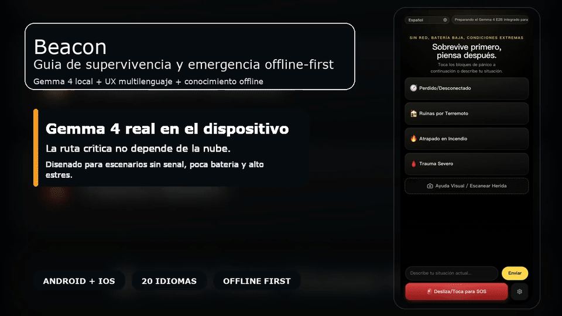

# Beacon

<p align="center">
  <strong>Beacon convierte un telefono en una herramienta de emergencia offline-first impulsada por inferencia real de Gemma 4 en el dispositivo.</strong>
</p>

<p align="center">
  Repository Docs:
  <a href="./README.md">English</a>
  ·
  <a href="./README.zh-CN.md">简体中文</a>
  ·
  <a href="./README.zh-TW.md">繁體中文</a>
  ·
  <a href="./README.ja.md">日本語</a>
  ·
  <a href="./README.ko.md">한국어</a>
  ·
  <a href="./README.es.md">Español</a>
  ·
  <a href="./README.fr.md">Français</a>
  ·
  <a href="./README.de.md">Deutsch</a>
  ·
  <a href="./README.pt.md">Português</a>
  ·
  <a href="./README.ar.md">العربية</a>
</p>

<p align="center">
  <a href="./docs/assets/beacon-demo-hero-es.mp4">
    
  </a>
</p>

> Este README es una pagina de entrada en espanol. La referencia tecnica mas completa y actual sigue siendo [`README.md`](./README.md) en ingles.

## Descarga

- Instala el APK Android ARM64 mas reciente desde [GitHub Releases](https://github.com/wimi321/Beacon/releases)
- Abre `Settings & Models` en el primer inicio
- Descarga primero `Gemma 4 E2B` como configuracion recomendada; si tu dispositivo es mas potente, añade `Gemma 4 E4B`

Beacon usa un flujo ligero: primero se instala un APK pequeno y luego el modelo Gemma se descarga dentro de la app.

## Por que Beacon

- IA real en el dispositivo, no una envoltura de chat en la nube
- Recuperacion offline desde fuentes medicas y de supervivencia
- UI movil pensada para estres alto y atencion minima
- Flujo nativo de camara y fotos locales
- 20 idiomas de interfaz con selector manual y soporte RTL en arabe
- Memoria de sesion, SOS y hooks nativos de bateria, ubicacion y diagnostico

## Que hace

- Triaje por texto con Gemma 4 local
- Ayuda visual con camara o foto del album
- Busqueda de evidencia offline antes de inferir
- Memoria de conversacion para seguimientos continuos
- Shells nativos incluidos para Android e iOS

## Documentacion

- README principal en ingles: [`README.md`](./README.md)
- README en chino simplificado: [`README.zh-CN.md`](./README.zh-CN.md)
- Guia de contribucion: [`CONTRIBUTING.es.md`](./CONTRIBUTING.es.md), [`CONTRIBUTING.md`](./CONTRIBUTING.md)
- Politica de seguridad: [`SECURITY.es.md`](./SECURITY.es.md), [`SECURITY.md`](./SECURITY.md)
- Notas de i18n: [`docs/I18N.md`](./docs/I18N.md), [`docs/I18N.zh-CN.md`](./docs/I18N.zh-CN.md)

## Inicio rapido

```bash
npm install
npm run mobile:build
npm run mobile:android
npm run mobile:ios
```

Compilacion del APK ligero para GitHub:

```bash
npm run mobile:android:release:github
```

## Estado del proyecto

Beacon es una pre-release publica seria y funcional. No es un demo falso, pero tampoco un producto medico final.

Ya incluye:

- proyectos nativos de Android e iOS
- ruta real de inferencia Gemma 4 en el dispositivo
- base de conocimiento offline integrada
- UI multilenguaje
- memoria de sesion y flujo visual local

Se sigue reforzando:

- validacion en mas dispositivos reales
- estabilidad del runtime y GPU en iOS
- relevo mesh y propagacion SOS entre pares
- empaquetado final listo para tiendas
