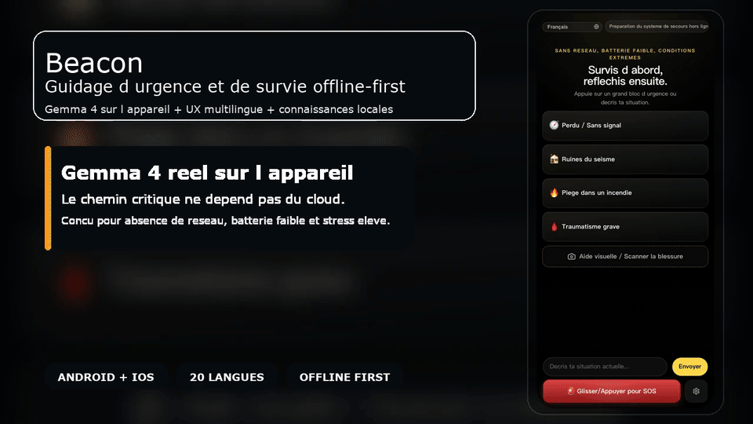

# Beacon

<p align="center">
  <strong>Beacon transforme un telephone en outil d urgence offline-first, alimente par une vraie inference Gemma 4 executee directement sur l appareil.</strong>
</p>

<p align="center">
  Repository Docs:
  <a href="./README.md">English</a>
  ·
  <a href="./README.zh-CN.md">简体中文</a>
  ·
  <a href="./README.zh-TW.md">繁體中文</a>
  ·
  <a href="./README.ja.md">日本語</a>
  ·
  <a href="./README.ko.md">한국어</a>
  ·
  <a href="./README.es.md">Español</a>
  ·
  <a href="./README.fr.md">Français</a>
  ·
  <a href="./README.de.md">Deutsch</a>
  ·
  <a href="./README.pt.md">Português</a>
  ·
  <a href="./README.ar.md">العربية</a>
</p>

<p align="center">
  <a href="./docs/assets/beacon-demo-hero-fr.mp4">
    
  </a>
</p>

> Ce README est une page d accueil concise en francais. La reference technique la plus complete et la plus a jour reste [`README.md`](./README.md) en anglais.

## Telechargement

- Installez le dernier APK Android ARM64 depuis [GitHub Releases](https://github.com/wimi321/Beacon/releases)
- Ouvrez `Settings & Models` au premier lancement
- Telechargez d abord `Gemma 4 E2B` comme modele recommande, puis `Gemma 4 E4B` si votre appareil est plus puissant

Beacon suit un schema leger: petit APK d abord, puis telechargement du modele Gemma directement dans l application.

## Pourquoi Beacon

- vraie IA locale, pas un simple wrapper cloud
- recuperation hors ligne depuis des sources medicales et de survie
- interface mobile pensee pour le stress et l attention minimale
- camera native et import de photo locale
- 20 langues UI avec commutateur manuel et RTL arabe
- memoire de session, SOS et integrations natives batterie / geolocalisation / diagnostics

## Capacites principales

- triage texte avec Gemma 4 local
- aide visuelle a partir de la camera ou d une photo
- recherche de preuves hors ligne avant l inference
- memoire de conversation pour le suivi
- shells natifs Android et iOS inclus

## Documentation

- README principal anglais: [`README.md`](./README.md)
- README chinois simplifie: [`README.zh-CN.md`](./README.zh-CN.md)
- Guide de contribution: [`CONTRIBUTING.fr.md`](./CONTRIBUTING.fr.md), [`CONTRIBUTING.md`](./CONTRIBUTING.md)
- Politique de securite: [`SECURITY.fr.md`](./SECURITY.fr.md), [`SECURITY.md`](./SECURITY.md)
- Notes i18n: [`docs/I18N.md`](./docs/I18N.md), [`docs/I18N.zh-CN.md`](./docs/I18N.zh-CN.md)

## Demarrage rapide

```bash
npm install
npm run mobile:build
npm run mobile:android
npm run mobile:ios
```

Build APK leger pour GitHub:

```bash
npm run mobile:android:release:github
```

## Etat du projet

Beacon est une pre-release publique serieuse et executable. Ce n est pas une fausse demo, mais ce n est pas encore un produit medical final.

Deja en place:

- projets natifs Android et iOS
- inference Gemma 4 sur l appareil
- base de connaissances hors ligne integree
- interface multilingue
- memoire de session et flux visuel local

Toujours en consolidation:

- validation sur plus d appareils reels
- stabilite runtime / GPU sur iOS
- relais mesh et extension SOS pair a pair
- packaging final pret pour les stores
