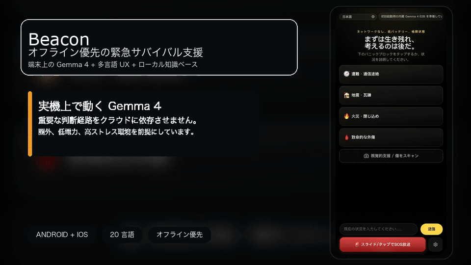

# Beacon

<p align="center">
  <strong>Beacon は、クラウド依存ではなく実機上の Gemma 4 推論で動く、オフライン優先の緊急サバイバル支援アプリです。</strong>
</p>

<p align="center">
  Repository Docs:
  <a href="./README.md">English</a>
  ·
  <a href="./README.zh-CN.md">简体中文</a>
  ·
  <a href="./README.zh-TW.md">繁體中文</a>
  ·
  <a href="./README.ja.md">日本語</a>
  ·
  <a href="./README.ko.md">한국어</a>
  ·
  <a href="./README.es.md">Español</a>
  ·
  <a href="./README.fr.md">Français</a>
  ·
  <a href="./README.de.md">Deutsch</a>
  ·
  <a href="./README.pt.md">Português</a>
  ·
  <a href="./README.ar.md">العربية</a>
</p>

<p align="center">
  <a href="./docs/assets/beacon-demo-hero-ja.mp4">
    
  </a>
</p>

> この README は日本語の概要ページです。技術的に最も詳細で最新の記述は英語版 [`README.md`](./README.md) を基準にしています。

## ダウンロード

- 最新の Android ARM64 APK を [GitHub Releases](https://github.com/wimi321/Beacon/releases) から取得
- 初回起動後に `Settings & Models` を開く
- まずは推奨モデル `Gemma 4 E2B` をダウンロードし、より高精度が必要なら `Gemma 4 E4B` を追加

Beacon は軽量 APK を先に配布し、Gemma モデル本体はアプリ内で取得する方式を採用しています。

## Beacon の特徴

- クラウド依存ではなく、実機上の本物の AI 推論
- 医療・災害・野外サバイバル知識を含むオフライン知識ベース
- パニック時でも使いやすいモバイル UI
- カメラ撮影とローカル写真入力に対応
- 20 UI 言語とアラビア語 RTL をサポート
- 会話メモリ、SOS、バッテリー・位置情報などのネイティブ連携

## 主な機能

- 緊急時のテキスト相談
- 写真を使ったローカル視覚支援
- 推論前のオフライン知識検索と根拠付け
- 最近の会話、要約、視覚コンテキストの保持
- Android / iOS ネイティブシェルを同梱

## ドキュメント

- 英語版メイン README: [`README.md`](./README.md)
- 簡体字中国語 README: [`README.zh-CN.md`](./README.zh-CN.md)
- 貢献ガイド: [`CONTRIBUTING.ja.md`](./CONTRIBUTING.ja.md)、[`CONTRIBUTING.md`](./CONTRIBUTING.md)
- セキュリティ方針: [`SECURITY.ja.md`](./SECURITY.ja.md)、[`SECURITY.md`](./SECURITY.md)
- i18n ノート: [`docs/I18N.md`](./docs/I18N.md)、[`docs/I18N.zh-CN.md`](./docs/I18N.zh-CN.md)

## クイックスタート

```bash
npm install
npm run mobile:build
npm run mobile:android
npm run mobile:ios
```

GitHub 配布向けの軽量 Android APK:

```bash
npm run mobile:android:release:github
```

## プロジェクト状況

Beacon は実際に動作する公開プレリリースです。単なるデモではありませんが、完成済みの医療製品でもありません。

現在含まれているもの:

- Android / iOS ネイティブプロジェクト
- 端末上の Gemma 4 推論経路
- バンドル済みオフライン知識ベース
- 多言語 UI
- セッションメモリとローカル画像導線

現在強化中のもの:

- より広い実機検証
- iOS GPU / runtime の安定化
- メッシュ中継と SOS 拡張
- ストア配布向けの最終仕上げ
