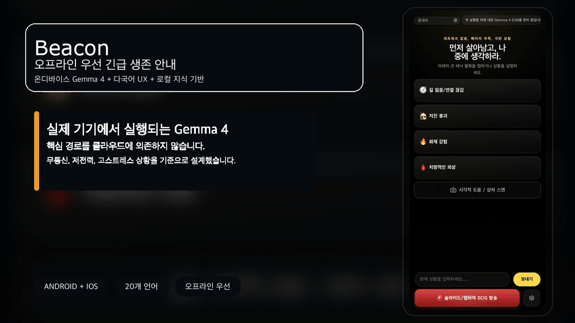

# Beacon

<p align="center">
  <strong>Beacon은 클라우드 채팅 래퍼가 아니라, 실제 온디바이스 Gemma 4 추론으로 동작하는 오프라인 우선 긴급 생존 안내 앱입니다.</strong>
</p>

<p align="center">
  Repository Docs:
  <a href="./README.md">English</a>
  ·
  <a href="./README.zh-CN.md">简体中文</a>
  ·
  <a href="./README.zh-TW.md">繁體中文</a>
  ·
  <a href="./README.ja.md">日本語</a>
  ·
  <a href="./README.ko.md">한국어</a>
  ·
  <a href="./README.es.md">Español</a>
  ·
  <a href="./README.fr.md">Français</a>
  ·
  <a href="./README.de.md">Deutsch</a>
  ·
  <a href="./README.pt.md">Português</a>
  ·
  <a href="./README.ar.md">العربية</a>
</p>

<p align="center">
  <a href="./docs/assets/beacon-demo-hero-ko.mp4">
    
  </a>
</p>

> 이 README는 한국어 요약 랜딩 페이지입니다. 가장 자세하고 최신의 기술 기준 문서는 영어판 [`README.md`](./README.md) 입니다.

## 다운로드

- 최신 Android ARM64 APK를 [GitHub Releases](https://github.com/wimi321/Beacon/releases)에서 설치
- 첫 실행 후 `Settings & Models` 열기
- 기본 권장 모델인 `Gemma 4 E2B`를 먼저 다운로드하고, 더 강한 기기에서는 `Gemma 4 E4B`도 추가 가능

Beacon은 작은 APK를 먼저 배포하고, Gemma 모델은 앱 안에서 내려받는 경량 배포 방식을 사용합니다.

## 왜 Beacon인가

- 클라우드가 아니라 실제 기기 내 AI 추론
- 의료, 재난, 야외 생존 지식을 포함한 오프라인 지식 기반
- 공황 상태에서도 이해하기 쉬운 모바일 UI
- 카메라 촬영과 로컬 사진 입력 지원
- 20개 UI 언어와 아랍어 RTL 지원
- 대화 메모리, SOS, 배터리 / 위치 같은 네이티브 연동

## 핵심 기능

- 긴급 텍스트 상담
- 사진 기반 로컬 시각 지원
- 추론 전 오프라인 지식 검색과 근거 결합
- 최근 대화, 요약, 시각 맥락 메모리 유지
- Android / iOS 네이티브 셸 포함

## 문서

- 영어 메인 README: [`README.md`](./README.md)
- 중국어 README: [`README.zh-CN.md`](./README.zh-CN.md)
- 기여 가이드: [`CONTRIBUTING.ko.md`](./CONTRIBUTING.ko.md), [`CONTRIBUTING.md`](./CONTRIBUTING.md)
- 보안 정책: [`SECURITY.ko.md`](./SECURITY.ko.md), [`SECURITY.md`](./SECURITY.md)
- i18n 문서: [`docs/I18N.md`](./docs/I18N.md), [`docs/I18N.zh-CN.md`](./docs/I18N.zh-CN.md)

## 빠른 시작

```bash
npm install
npm run mobile:build
npm run mobile:android
npm run mobile:ios
```

GitHub 배포용 경량 APK 빌드:

```bash
npm run mobile:android:release:github
```

## 프로젝트 상태

Beacon은 실제로 동작하는 공개 프리릴리스입니다. 단순 데모는 아니지만 완성된 의료 제품도 아닙니다.

현재 포함된 것:

- Android / iOS 네이티브 프로젝트
- 온디바이스 Gemma 4 추론 경로
- 번들 오프라인 지식 베이스
- 다국어 UI
- 세션 메모리와 로컬 사진 흐름

현재 계속 다듬는 것:

- 더 넓은 실기기 검증
- iOS GPU / runtime 안정화
- 메시 릴레이와 SOS 확장
- 스토어 등급 패키징과 최종 출시 준비
