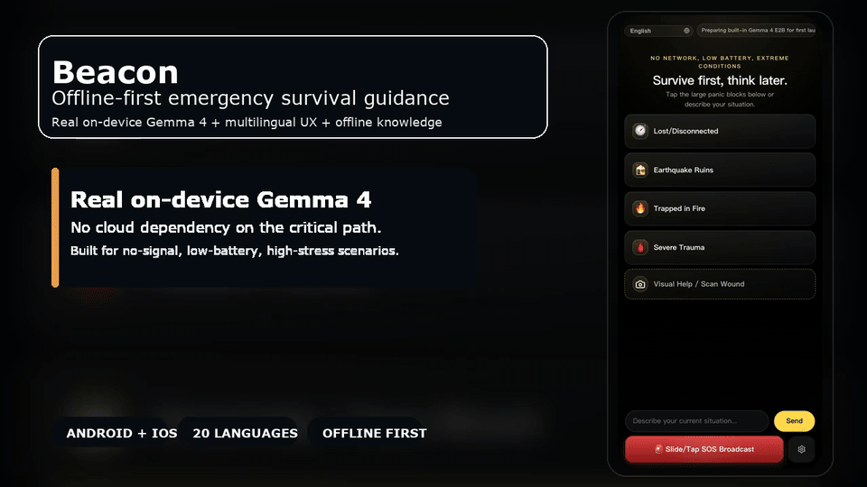

# Beacon

<p align="center">
  <strong>Offline-first emergency survival guidance powered by real on-device Gemma 4 inference.</strong>
</p>

<p align="center">
  Beacon turns a phone into a local emergency tool for triage, wilderness survival, disaster response, and crisis guidance when the network is gone.
</p>

<p align="center">
  Repository Docs:
  <a href="./README.md">English</a>
  ·
  <a href="./README.zh-CN.md">简体中文</a>
  ·
  <a href="./README.zh-TW.md">繁體中文</a>
  ·
  <a href="./README.ja.md">日本語</a>
  ·
  <a href="./README.ko.md">한국어</a>
  ·
  <a href="./README.es.md">Español</a>
  ·
  <a href="./README.fr.md">Français</a>
  ·
  <a href="./README.de.md">Deutsch</a>
  ·
  <a href="./README.pt.md">Português</a>
  ·
  <a href="./README.ar.md">العربية</a>
</p>

<p align="center">
  <a href="https://github.com/wimi321/Beacon/actions/workflows/ci.yml"></a>
  <a href="https://github.com/wimi321/Beacon/stargazers"></a>
  <a href="https://github.com/wimi321/Beacon/issues"></a>
  <a href="./LICENSE"></a>
  
  
  
  
  
  
</p>

<p align="center">
  <a href="./docs/assets/beacon-demo-hero.mp4">
    
  </a>
</p>

## Download

- Install the latest Android ARM64 APK from [GitHub Releases](https://github.com/wimi321/Beacon/releases)
- Open `Settings & Models` on first launch
- Download `Gemma 4 E2B` for the fastest recommended setup, or `Gemma 4 E4B` for a larger higher-accuracy model

This release flow mirrors the lightweight official app pattern: ship a small installable APK first, then let the user pull the on-device Gemma model inside the app.

## Languages

Beacon is a multilingual product and this repository now exposes multilingual project docs as well.

Repository documentation coverage:

- Localized README landing pages: [`English`](./README.md), [`简体中文`](./README.zh-CN.md), [`繁體中文`](./README.zh-TW.md), [`日本語`](./README.ja.md), [`한국어`](./README.ko.md), [`Español`](./README.es.md), [`Français`](./README.fr.md), [`Deutsch`](./README.de.md), [`Português`](./README.pt.md), [`العربية`](./README.ar.md)
- Localized collaboration docs: [`CONTRIBUTING.md`](./CONTRIBUTING.md), [`CONTRIBUTING.zh-CN.md`](./CONTRIBUTING.zh-CN.md), [`CONTRIBUTING.zh-TW.md`](./CONTRIBUTING.zh-TW.md), [`CONTRIBUTING.ja.md`](./CONTRIBUTING.ja.md), [`CONTRIBUTING.ko.md`](./CONTRIBUTING.ko.md), [`CONTRIBUTING.es.md`](./CONTRIBUTING.es.md), [`CONTRIBUTING.fr.md`](./CONTRIBUTING.fr.md), [`CONTRIBUTING.de.md`](./CONTRIBUTING.de.md), [`CONTRIBUTING.pt.md`](./CONTRIBUTING.pt.md), [`CONTRIBUTING.ar.md`](./CONTRIBUTING.ar.md)
- Localized security docs: [`SECURITY.md`](./SECURITY.md), [`SECURITY.zh-CN.md`](./SECURITY.zh-CN.md), [`SECURITY.zh-TW.md`](./SECURITY.zh-TW.md), [`SECURITY.ja.md`](./SECURITY.ja.md), [`SECURITY.ko.md`](./SECURITY.ko.md), [`SECURITY.es.md`](./SECURITY.es.md), [`SECURITY.fr.md`](./SECURITY.fr.md), [`SECURITY.de.md`](./SECURITY.de.md), [`SECURITY.pt.md`](./SECURITY.pt.md), [`SECURITY.ar.md`](./SECURITY.ar.md)
- Internationalization references: [`docs/I18N.md`](./docs/I18N.md), [`docs/I18N.zh-CN.md`](./docs/I18N.zh-CN.md)
- README hero assets now ship in the same 10 locales as the README landing pages

App UI locales currently supported:

| Code | Language | Native name | Direction |
| --- | --- | --- | --- |
| `en` | English | English | LTR |
| `zh-CN` | Chinese (Simplified) | 简体中文 | LTR |
| `zh-TW` | Chinese (Traditional) | 繁體中文 | LTR |
| `ja` | Japanese | 日本語 | LTR |
| `ko` | Korean | 한국어 | LTR |
| `es` | Spanish | Español | LTR |
| `fr` | French | Français | LTR |
| `de` | German | Deutsch | LTR |
| `pt` | Portuguese | Português | LTR |
| `ru` | Russian | Русский | LTR |
| `ar` | Arabic | العربية | RTL |
| `hi` | Hindi | हिन्दी | LTR |
| `id` | Indonesian | Bahasa Indonesia | LTR |
| `it` | Italian | Italiano | LTR |
| `tr` | Turkish | Türkçe | LTR |
| `vi` | Vietnamese | Tiếng Việt | LTR |
| `th` | Thai | ไทย | LTR |
| `nl` | Dutch | Nederlands | LTR |
| `pl` | Polish | Polski | LTR |
| `uk` | Ukrainian | Українська | LTR |

## Demo

- English home screenshot: [`docs/assets/beacon-home-android-en.png`](./docs/assets/beacon-home-android-en.png)
- Simplified Chinese home screenshot: [`docs/assets/beacon-home-android-zh-CN.png`](./docs/assets/beacon-home-android-zh-CN.png)
- README hero GIF: [`docs/assets/beacon-demo-hero.gif`](./docs/assets/beacon-demo-hero.gif)
- Simplified Chinese hero GIF: [`docs/assets/beacon-demo-hero-zh-CN.gif`](./docs/assets/beacon-demo-hero-zh-CN.gif)
- Short video: [`docs/assets/beacon-demo-hero.mp4`](./docs/assets/beacon-demo-hero.mp4)
- Poster frame: [`docs/assets/beacon-demo-hero-poster.png`](./docs/assets/beacon-demo-hero-poster.png)
- Rebuild command: `npm run readme:demo`

## Why Beacon

Most emergency tools fail exactly when people need them most: no signal, low battery, no cloud, no time.

Beacon is built for the opposite environment:

- Real on-device AI, not a cloud chat wrapper
- Offline-first emergency retrieval from bundled medical and survival sources
- Panic-proof mobile UI designed for high stress and low attention
- Native camera and local photo intake for visual help flows
- Multilingual UI with manual language switching and RTL support
- Session memory that survives within the active emergency conversation
- Device hooks for battery state, location, SOS packaging, and native runtime diagnostics

## What It Does

| Capability | What Beacon does |
| --- | --- |
| Text triage | Uses local Gemma 4 to answer urgent user questions with offline knowledge grounding |
| Visual help | Lets users take or pick a photo and run local visual emergency guidance flow |
| Offline retrieval | Pulls compact evidence from a bundled knowledge base before inference |
| Session memory | Keeps recent turns, summary memory, and last visual context inside the active session |
| Survival guidance | Covers first aid, wilderness survival, extreme weather, disaster, conflict, radiation, and biohazard scenarios |
| Multilingual UX | Supports 20 UI languages, including Arabic RTL |
| Native mobile shell | Ships through Capacitor with Android and iOS projects included |

## Architecture


## Knowledge Base

Beacon ships with a bundled offline knowledge corpus built for emergency retrieval, not generic web search.

- `6,302` source records
- `14,229` offline knowledge entries
- Compact grounding optimized for mobile prompt budgets

Current source families include:

- US Army `FM 21-76 / FM 3-05.70 Survival Manual`
- `NPS` National Park Service wilderness guidance
- `NWS / NOAA` weather and lightning safety guidance
- `CDC` outdoor hazards, poisoning, heat, cold, radiation, and emergency health content
- `Ready.gov` disaster, radiation, shelter-in-place, explosion, wildfire, flood, and outage guidance
- `WHO` emergency and snakebite materials
- `Merck / MSD Manual`
- `NHS`
- `MedlinePlus`
- `American Red Cross`

The knowledge base is used as reference grounding. If retrieval is weak or misses the scenario, Beacon still performs real local model inference instead of falling back to fake template output.

## Repository Publishing Notes

To keep the public repository clean and pushable:

- generated native web bundles are not meant to be source-controlled
- oversized iOS LiteRT vendor archives are intentionally excluded from git because GitHub rejects regular files above `100 MB`

See [`ios/App/Vendor/README.md`](./ios/App/Vendor/README.md) for the local iOS asset expectations.

## Mobile UX Principles

Beacon is intentionally not designed like a normal chatbot.

- One-screen-first emergency entry
- Large panic actions for common life-threatening scenarios
- Minimal cognitive load under stress
- High contrast OLED-friendly palette
- No dependency on system locale alone; manual language switch is always visible
- Native back navigation and conversation reset behavior

## Current Project Status

This repository is being published as a serious pre-release, not as a finished medical product.

What is in place now:

- Android native project included
- iOS native project included
- Frontend tests passing
- Android unit tests and debug build passing
- Bundled offline knowledge base included
- Local session memory and retrieval grounding included
- Native camera prompt flow included

What is still being hardened:

- Final broad real-device validation across more phones
- iOS runtime and GPU path verification on target release devices
- Mesh relay implementation beyond local SOS packaging
- Store publishing metadata and final release polish

## Quick Start

### Prerequisites

- Node.js 20+
- npm
- Xcode for iOS work
- Android Studio / Android SDK for Android work

### Install

```bash
npm install
```

### Build web + sync native shells

```bash
npm run mobile:build
```

### Open native projects

```bash
npm run mobile:android
npm run mobile:ios
```

### Build Android release artifacts

```bash
npm run mobile:android:release
```

### Build the lightweight GitHub APK

```bash
npm run mobile:android:release:github
```

## Development Commands

```bash
npm test
npm run build
npm run knowledge:build
npm run mobile:build
npm run mobile:android
npm run mobile:ios
npm run mobile:android:release
```

## Repository Layout

```text
src/                 React app, i18n, retrieval glue, UI logic
android/             Capacitor Android shell + native Beacon bridge
ios/                 Capacitor iOS shell + native Beacon bridge
knowledge/           Bundled offline knowledge manifest and entries
scripts/             Build, sync, and runtime helper scripts
docs/                Integration notes, architecture, acceptance docs
```

## Testing

Verified locally on this branch:

```bash
npm test
cd android && ./gradlew testDebugUnitTest assembleDebug
```

Representative checks already wired into the codebase:

- frontend component and interaction tests
- retrieval and grounding tests
- session memory tests
- prompt composition tests
- Android native unit tests

## Safety Notice

Beacon is an emergency assistance tool, not a replacement for licensed medical care, rescue services, or professional incident response.

- Always call local emergency services when a network is available
- Treat Beacon guidance as last-mile survival support for disrupted environments
- Validate high-risk decisions against trained professionals whenever possible

## Roadmap

- [x] Offline-first retrieval and grounded local inference
- [x] 20-language UI with manual switching and RTL support
- [x] Native Android and iOS shells
- [x] Camera and local photo intake flow
- [x] Session memory sidecar for continuous conversations
- [ ] Final iPhone release-device validation
- [ ] Stronger multimodal local runtime verification on iOS
- [ ] Mesh relay and peer-to-peer SOS propagation
- [ ] Public benchmark and evaluation suite
- [ ] Store-grade release packaging

## Contributing

Contributions are welcome in:

- emergency medicine review
- wilderness survival knowledge curation
- multilingual localization
- mobile runtime optimization
- real-device QA
- accessibility and panic-proof UX

If you want to help, open an issue with:

- device model
- platform and OS version
- exact prompt or scenario
- whether the issue happened in text, image, or reset flow

See also:

- [`CONTRIBUTING.md`](./CONTRIBUTING.md)
- [`CONTRIBUTING.zh-CN.md`](./CONTRIBUTING.zh-CN.md)
- [`SECURITY.md`](./SECURITY.md)
- [`SECURITY.zh-CN.md`](./SECURITY.zh-CN.md)
- [`CODE_OF_CONDUCT.md`](./CODE_OF_CONDUCT.md)

## Community

- Bug reports: use the GitHub issue form
- Feature ideas: use the GitHub feature request form
- Security reports: follow [`SECURITY.md`](./SECURITY.md)
- Localization work: see [`docs/I18N.md`](./docs/I18N.md)
- Discussions: use the repository Discussions tab for design and roadmap conversations

## Project Notes

- Main integration reference: [`docs/Backend-Integration.md`](./docs/Backend-Integration.md)
- Product concept notes: [`docs/开发文档.txt`](./docs/开发文档.txt)
- User acceptance checklist: [`docs/User-E2E-Acceptance-Checklist.md`](./docs/User-E2E-Acceptance-Checklist.md)
- Release notes index: [`docs/releases/README.md`](./docs/releases/README.md)
- Current release note: [`docs/releases/v0.1.1.md`](./docs/releases/v0.1.1.md)
- Internationalization notes: [`docs/I18N.md`](./docs/I18N.md)
- Release history: [`CHANGELOG.md`](./CHANGELOG.md)

## License

Beacon is released under the [Apache-2.0 License](./LICENSE).
