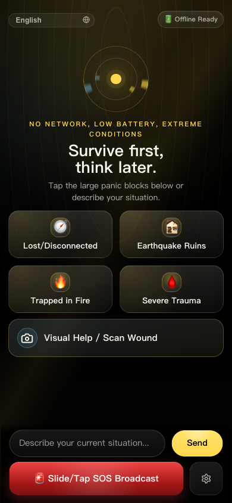
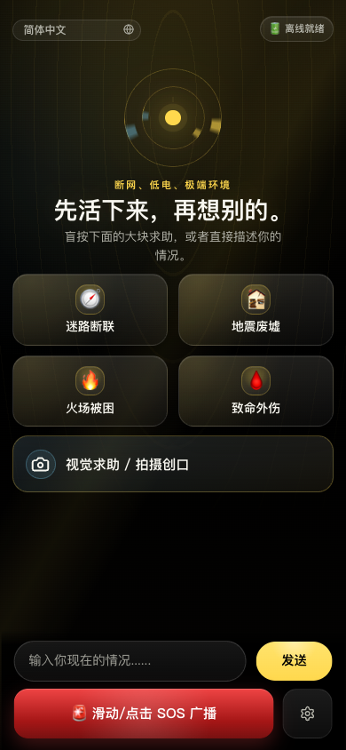
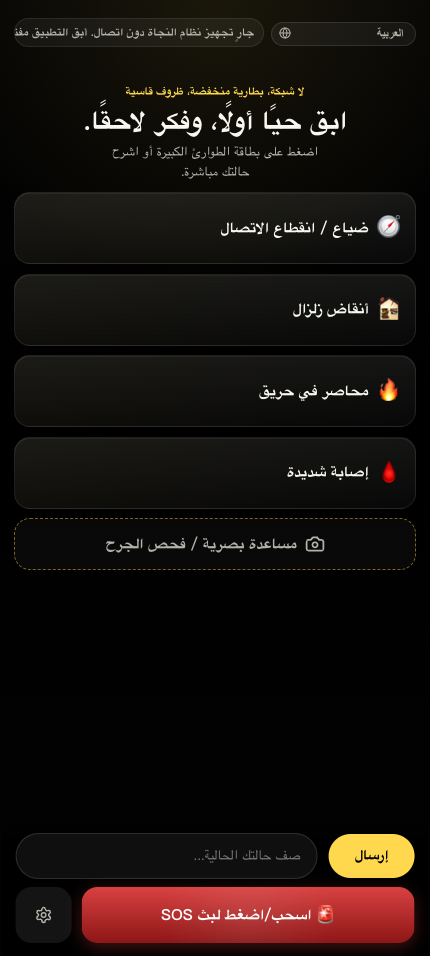
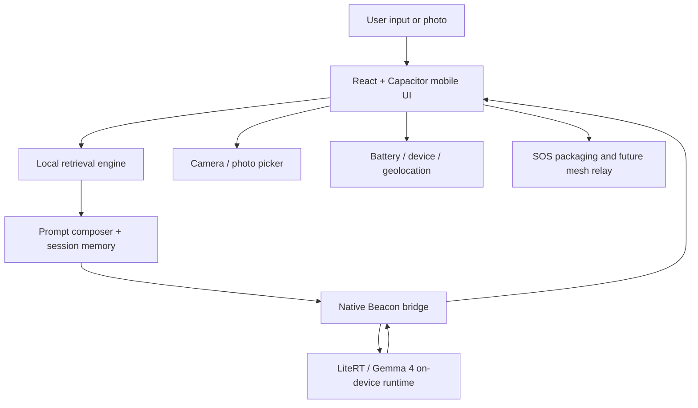

<p align="center">
  
</p>

<h1 align="center">Beacon</h1>

<p align="center">
  <strong>Your phone becomes a survival AI — powered by Gemma 4 running entirely on-device, no internet needed.</strong>
</p>

<p align="center">
  Beacon turns any Android phone into an offline emergency tool.<br>
  Real AI inference. 14,229 expert knowledge entries. Zero cloud dependency.<br>
  Built for earthquakes, wildfires, wilderness, and every moment when the network is gone.
</p>

<p align="center">
  <a href="https://github.com/wimi321/Beacon/releases/latest"></a>
  <a href="https://github.com/wimi321/Beacon/releases"></a>
  <a href="https://github.com/wimi321/Beacon/actions/workflows/ci.yml"></a>
  <a href="https://github.com/wimi321/Beacon/stargazers"></a>
  <a href="./LICENSE"></a>
</p>

<p align="center">
  
  
  
  
  
  
</p>

<p align="center">
  <a href="./README.md">English</a> ·
  <a href="./README.zh-CN.md">简体中文</a> ·
  <a href="./README.zh-TW.md">繁體中文</a> ·
  <a href="./README.ja.md">日本語</a> ·
  <a href="./README.ko.md">한국어</a> ·
  <a href="./README.es.md">Español</a> ·
  <a href="./README.fr.md">Français</a> ·
  <a href="./README.de.md">Deutsch</a> ·
  <a href="./README.pt.md">Português</a> ·
  <a href="./README.ar.md">العربية</a>
</p>

<p align="center">
  <a href="./docs/assets/beacon-demo-hero.mp4">
    
  </a>
</p>

---

## Download

> [!TIP]
> **Get started in 2 minutes:** Install APK → open *Settings & Models* → download **Gemma 4 E2B** (~2.6 GB) → fully offline.

<p>
  <a href="https://github.com/wimi321/Beacon/releases/latest"></a>
</p>

Choose your model:

| Model | Size | Best for |
| --- | --- | --- |
| **Gemma 4 E2B** | ~2.6 GB | Fast setup, recommended for most devices |
| **Gemma 4 E4B** | ~3.7 GB | Higher accuracy, needs more RAM |

Model downloads are resumable and use an ordered mirror list. Beacon tries the
China-friendly `hf-mirror.com` link first, then falls back to the official
Hugging Face URL if the first source is unavailable.

---

## What Makes Beacon Different

🧠 **Real On-Device AI** — Gemma 4 (2B / 4B parameters) runs entirely on your phone via Google's [LiteRT](https://ai.google.dev/edge/litert) runtime. No cloud, no API keys, no data leaves your device. Ever.

📡 **Works When Networks Don't** — Designed for earthquakes, hurricanes, wildfires, and conflict zones. Beacon works in airplane mode, in basements, and off the grid.

📚 **14,229 Expert Knowledge Entries** — Bundled offline from the US Army Survival Manual, WHO, CDC, Red Cross, NPS, Ready.gov, and more. Retrieved locally before every AI response.

📸 **Visual Emergency Analysis** — Point your camera at an injury, a plant, or a hazard. The on-device model analyzes what it sees and provides guidance.

🌍 **20 Languages, Including RTL** — From English to Arabic, switch instantly in-app. No extra download required.

🔋 **Crisis-Optimized UX** — Large panic buttons, high-contrast OLED palette, minimal cognitive load. Designed for shaking hands and racing hearts.

---

## When You Need Beacon

**After an earthquake** — Cell towers are down. You have a deep cut and no first-aid training. Beacon walks you through wound care step by step, grounded in Red Cross and WHO protocols, running entirely on your phone.

**Lost in the wilderness** — No signal, no map app. Beacon's offline knowledge base covers shelter building, water purification, navigation, and plant identification from the US Army Survival Manual.

**During a chemical spill** — Conflicting information, overwhelmed emergency lines. Beacon retrieves CDC and Ready.gov hazmat guidance instantly — no internet required.

---

## Screenshots

<p align="center">
  
  &nbsp;&nbsp;
  
  &nbsp;&nbsp;
  
</p>
<p align="center"><em>English · 简体中文 · العربية (RTL)</em></p>

> More localized demos: [日本語](./docs/assets/beacon-home-android-ja.png) · [한국어](./docs/assets/beacon-home-android-ko.png) · [Español](./docs/assets/beacon-home-android-es.png) · [Français](./docs/assets/beacon-home-android-fr.png) · [Deutsch](./docs/assets/beacon-home-android-de.png) · [Português](./docs/assets/beacon-home-android-pt.png) · [繁體中文](./docs/assets/beacon-home-android-zh-TW.png)

---

## Architecture

All inference runs locally on the device. No data is sent to any server.



**Stack:** React + TypeScript frontend → Capacitor native bridge → Kotlin (Android) / Obj-C++ (iOS) → LiteRT-LM → Gemma 4

---

## Knowledge Base

> [!NOTE]
> Beacon's knowledge base contains **6,302 source records** and **14,229 entries** compiled from authoritative emergency sources. All data is bundled in the app — no download or internet needed after install.

Sources include:

- **US Army** — FM 21-76 / FM 3-05.70 Survival Manual
- **WHO** — Emergency health and snakebite protocols
- **CDC** — Outdoor hazards, radiation, poisoning, heat/cold guidance
- **American Red Cross** — First aid and disaster response
- **Ready.gov** — FEMA disaster, radiation, shelter-in-place, wildfire, flood
- **NPS / NWS / NOAA** — Wilderness safety and severe weather
- **NHS / MedlinePlus / Merck Manual** — Medical references

The knowledge base provides retrieval grounding. When retrieval misses a scenario, Beacon still performs real local model inference — it never falls back to template output.

---

## Languages

Beacon supports **20 UI languages** including Arabic RTL. The app detects device locale or allows manual switching at any time.

README documentation is available in **10 locales** with localized hero demos.

<details>
<summary>View all 20 supported languages</summary>

| Code | Language | Native Name | Direction |
| --- | --- | --- | --- |
| `en` | English | English | LTR |
| `zh-CN` | Chinese (Simplified) | 简体中文 | LTR |
| `zh-TW` | Chinese (Traditional) | 繁體中文 | LTR |
| `ja` | Japanese | 日本語 | LTR |
| `ko` | Korean | 한국어 | LTR |
| `es` | Spanish | Español | LTR |
| `fr` | French | Français | LTR |
| `de` | German | Deutsch | LTR |
| `pt` | Portuguese | Português | LTR |
| `ru` | Russian | Русский | LTR |
| `ar` | Arabic | العربية | RTL |
| `hi` | Hindi | हिन्दी | LTR |
| `id` | Indonesian | Bahasa Indonesia | LTR |
| `it` | Italian | Italiano | LTR |
| `tr` | Turkish | Türkçe | LTR |
| `vi` | Vietnamese | Tiếng Việt | LTR |
| `th` | Thai | ไทย | LTR |
| `nl` | Dutch | Nederlands | LTR |
| `pl` | Polish | Polski | LTR |
| `uk` | Ukrainian | Українська | LTR |

</details>

Localized documentation: [CONTRIBUTING](./CONTRIBUTING.md) · [SECURITY](./SECURITY.md) · [I18N Guide](./docs/I18N.md) — each available in up to 10 locales.

---

## Quick Start

### Prerequisites

- Node.js 20+
- npm
- Android Studio / Android SDK
- Xcode (for iOS)

### Install & Build

```bash
# Install dependencies
npm install

# Build web app + sync native shells
npm run mobile:build

# Open in Android Studio
npm run mobile:android

# Open in Xcode
npm run mobile:ios
```

### Build Release APK

```bash
# Standard release: APK only, users download Gemma in-app
npm run mobile:android:release

# GitHub APK release: APK only, arm64 only
npm run mobile:android:release:github

# Optional internal build: intentionally bundle Gemma E2B in the APK
npm run mobile:android:release:bundled
```

### Other Commands

```bash
npm test                    # Run frontend tests
npm run build               # Build web app
npm run knowledge:build     # Rebuild offline knowledge base
npm run readme:demo         # Regenerate README demo assets
```

---

## Testing

```bash
# Frontend (83 tests)
npm test

# Android native
cd android && ./gradlew testDebugUnitTest

# Dart backend
dart test

# Type check
npx tsc --noEmit
```

---

## Roadmap

- [x] Offline-first retrieval and grounded local Gemma 4 inference
- [x] 20-language UI with manual switching and Arabic RTL
- [x] Native Android and iOS shells with Capacitor bridge
- [x] Camera and photo intake for visual emergency guidance
- [x] Session memory for continuous emergency conversations
- [x] WCAG AA accessibility (focus indicators, reduced motion, contrast)
- [x] Prompt injection defense with structural markers
- [ ] Mesh relay and peer-to-peer SOS propagation
- [ ] iPhone release-device GPU path validation
- [ ] Public benchmark and evaluation suite
- [ ] Store-grade release packaging

---

## Contributing

Contributions are welcome — especially in emergency medicine review, survival knowledge curation, multilingual localization, mobile runtime optimization, real-device QA, and accessibility.

Please see [`CONTRIBUTING.md`](./CONTRIBUTING.md) for guidelines. When reporting issues, include your device model, OS version, and the exact prompt or scenario.

- Bug reports → [GitHub Issues](https://github.com/wimi321/Beacon/issues)
- Feature ideas → [GitHub Issues](https://github.com/wimi321/Beacon/issues)
- Security reports → [`SECURITY.md`](./SECURITY.md)
- Localization → [`docs/I18N.md`](./docs/I18N.md)
- Discussions → [GitHub Discussions](https://github.com/wimi321/Beacon/discussions)

---

## Safety Notice

> [!IMPORTANT]
> Beacon is an emergency assistance tool, **not a replacement** for licensed medical care, rescue services, or professional incident response.
>
> - Always call local emergency services when a network is available
> - Treat Beacon guidance as last-mile survival support for disrupted environments
> - Validate high-risk decisions against trained professionals whenever possible

---

## Acknowledgments

Beacon's offline knowledge base is built from publicly available emergency guidance:

**US Army** · **WHO** · **CDC** · **American Red Cross** · **Ready.gov (FEMA)** · **NPS** · **NWS / NOAA** · **NHS** · **MedlinePlus** · **Merck Manual**

Powered by [Google Gemma 4](https://ai.google.dev/gemma) via [LiteRT](https://ai.google.dev/edge/litert).

---

## License

Beacon is released under the [Apache-2.0 License](./LICENSE).
