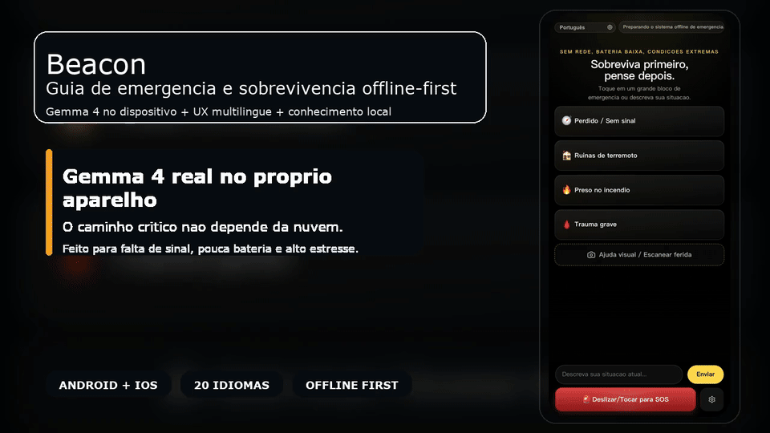

# Beacon

<p align="center">
  <strong>Beacon transforma um telefone em uma ferramenta de emergencia offline-first, alimentada por inferencia real do Gemma 4 executada no proprio dispositivo.</strong>
</p>

<p align="center">
  Repository Docs:
  <a href="./README.md">English</a>
  ·
  <a href="./README.zh-CN.md">简体中文</a>
  ·
  <a href="./README.zh-TW.md">繁體中文</a>
  ·
  <a href="./README.ja.md">日本語</a>
  ·
  <a href="./README.ko.md">한국어</a>
  ·
  <a href="./README.es.md">Español</a>
  ·
  <a href="./README.fr.md">Français</a>
  ·
  <a href="./README.de.md">Deutsch</a>
  ·
  <a href="./README.pt.md">Português</a>
  ·
  <a href="./README.ar.md">العربية</a>
</p>

<p align="center">
  <a href="./docs/assets/beacon-demo-hero-pt.mp4">
    
  </a>
</p>

> Este README e uma pagina de entrada resumida em portugues. A referencia tecnica mais completa e atual continua sendo [`README.md`](./README.md) em ingles.

## Download

- Instale o APK Android ARM64 mais recente em [GitHub Releases](https://github.com/wimi321/Beacon/releases)
- Abra `Settings & Models` no primeiro inicio
- Baixe primeiro `Gemma 4 E2B` como modelo recomendado; se o aparelho for mais forte, adicione `Gemma 4 E4B`

Beacon usa um fluxo leve: primeiro o APK pequeno, depois o modelo Gemma e baixado dentro do app.

## Por que Beacon

- IA real no dispositivo, nao um wrapper de nuvem
- recuperacao offline de fontes medicas e de sobrevivencia
- interface movel pensada para cenarios de panico e baixa atencao
- camera nativa e importacao de foto local
- 20 idiomas de UI com troca manual e RTL em arabe
- memoria de sessao, SOS e integracoes nativas de bateria, localizacao e diagnostico

## O que faz

- triagem por texto com Gemma 4 local
- ajuda visual com camera ou foto do aparelho
- busca de evidencia offline antes da inferencia
- memoria de conversa para continuidade
- shells nativos Android e iOS incluidos

## Documentacao

- README principal em ingles: [`README.md`](./README.md)
- README em chines simplificado: [`README.zh-CN.md`](./README.zh-CN.md)
- Guia de contribuicao: [`CONTRIBUTING.pt.md`](./CONTRIBUTING.pt.md), [`CONTRIBUTING.md`](./CONTRIBUTING.md)
- Politica de seguranca: [`SECURITY.pt.md`](./SECURITY.pt.md), [`SECURITY.md`](./SECURITY.md)
- Notas de i18n: [`docs/I18N.md`](./docs/I18N.md), [`docs/I18N.zh-CN.md`](./docs/I18N.zh-CN.md)

## Inicio rapido

```bash
npm install
npm run mobile:build
npm run mobile:android
npm run mobile:ios
```

Build do APK leve para GitHub:

```bash
npm run mobile:android:release:github
```

## Estado do projeto

Beacon e uma pre-release publica seria e funcional. Nao e um demo falso, mas ainda nao e um produto medico final.

Ja inclui:

- projetos nativos Android e iOS
- inferencia Gemma 4 no proprio dispositivo
- base de conhecimento offline integrada
- UI multilingue
- memoria de sessao e fluxo visual local

Ainda em reforco:

- validacao em mais dispositivos reais
- estabilidade de runtime / GPU no iOS
- relay mesh e expansao do SOS entre pares
- empacotamento final pronto para loja
