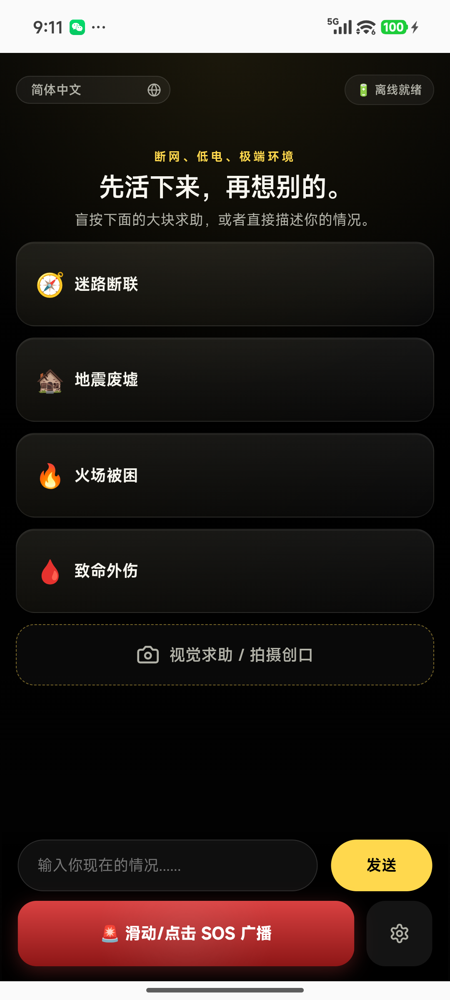
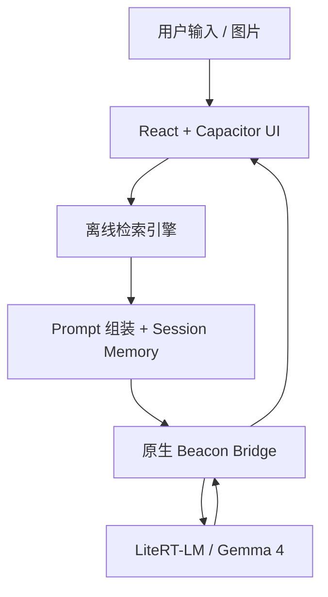

# Beacon

<p align="center">
  <strong>一个断网也能工作的本地应急自救应用，核心依赖真实端侧 Gemma 4 推理，而不是云端聊天接口。</strong>
</p>

<p align="center">
  
</p>

## 它是什么

Beacon 想解决的不是“在线问答”，而是更残酷的场景：

- 没信号
- 电量低
- 用户恐慌
- 周围没有专业人员
- 手机必须立刻给出能执行的建议

所以 Beacon 不是普通聊天 App，而是一套离线优先的移动端应急系统：

- 本地 Gemma 4 推理
- 本地知识库检索增强
- 原生相机/相册视觉求助入口
- 多语言与阿拉伯语 RTL 支持
- 会话记忆与返回主页重置
- 原生电量、位置、SOS 封包能力

## 当前能力

| 模块 | 当前状态 |
| --- | --- |
| 文本急救问答 | 已接入本地模型与离线知识检索 |
| 视觉求助 | 已支持拍照或从本机照片导入并进入本地视觉流程 |
| 离线知识库 | 已内置 6,302 个来源、14,229 条离线知识条目 |
| 多语言 | UI 已支持 20 种语言 |
| 原生壳 | Android / iOS 工程均已在仓库内 |
| 会话记忆 | 已支持最近轮次记忆、摘要记忆、视觉上下文记忆 |

## 知识库来源

当前离线知识库已覆盖以下主来源：

- 美军 `FM 21-76 / FM 3-05.70` 野外生存手册
- `NPS` 国家公园野外求生指南
- `NWS / NOAA` 雷暴、洪水、极端天气安全页
- `CDC` 户外危险、热伤害、低温、辐射、中毒、生物风险资料
- `Ready.gov` 火灾、洪水、核辐射、爆炸、断电、避难等灾害指南
- `WHO`
- `Merck / MSD Manual`
- `NHS`
- `MedlinePlus`
- `American Red Cross`

Beacon 的策略不是“知识库没命中就装死”，而是：

- 能命中时，用知识库高权重约束模型
- 命不中时，仍然进行真实本地模型推理
- 不允许前端假 AI 模板兜底

## 仓库发布说明

为了让公开仓库可以正常推送到 GitHub：

- 原生壳里同步出来的前端构建产物不纳入源码版本控制
- 体积超出 GitHub 普通 git 限制的 iOS LiteRT vendor 静态库也不直接入库

详情见 [`ios/App/Vendor/README.md`](./ios/App/Vendor/README.md)。

## 技术架构



## 运行方式

### 安装依赖

```bash
npm install
```

### 构建前端并同步原生工程

```bash
npm run mobile:build
```

### 打开原生工程

```bash
npm run mobile:android
npm run mobile:ios
```

### 安卓发布构建

```bash
npm run mobile:android:release
```

## 常用命令

```bash
npm test
npm run build
npm run knowledge:build
npm run mobile:build
npm run mobile:android
npm run mobile:ios
npm run mobile:android:release
```

## 当前项目状态

这是一个认真可运行的公开预发布版本，不是假 Demo，但也还不是最终版。

已经完成：

- 前端测试通过
- Android 单测与 Debug 构建通过
- 本地知识库已入库
- 原生相机与照片导入流程已接通
- 多语言 UI 已完成
- Android / iOS 原生桥接已接入

仍在持续打磨：

- 更多真机矩阵验证
- iOS 端 GPU / runtime 稳定性继续收口
- Mesh 近场中继能力
- 面向商店发布的最终元数据与发布流程

## 安全声明

Beacon 不是医生、医院或专业救援队的替代品。

- 有信号时，优先联系当地急救与救援系统
- Beacon 更适合“断网、断联、延迟获救”的最后一公里自救场景
- 高风险医疗决策请尽量交给专业人员确认

## 仓库说明

- 集成文档：[`docs/Backend-Integration.md`](./docs/Backend-Integration.md)
- 需求文档：[`docs/开发文档.txt`](./docs/开发文档.txt)
- 用户视角验收清单：[`docs/User-E2E-Acceptance-Checklist.md`](./docs/User-E2E-Acceptance-Checklist.md)
- 贡献指南：[`CONTRIBUTING.md`](./CONTRIBUTING.md)
- 安全策略：[`SECURITY.md`](./SECURITY.md)

## 许可证

当前公开版本使用 [`Apache-2.0`](./LICENSE) 许可证。
