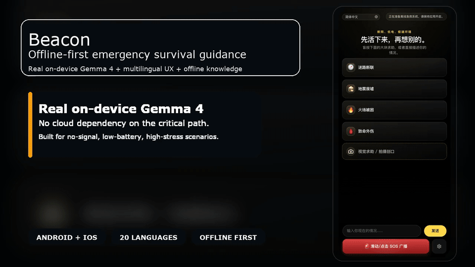
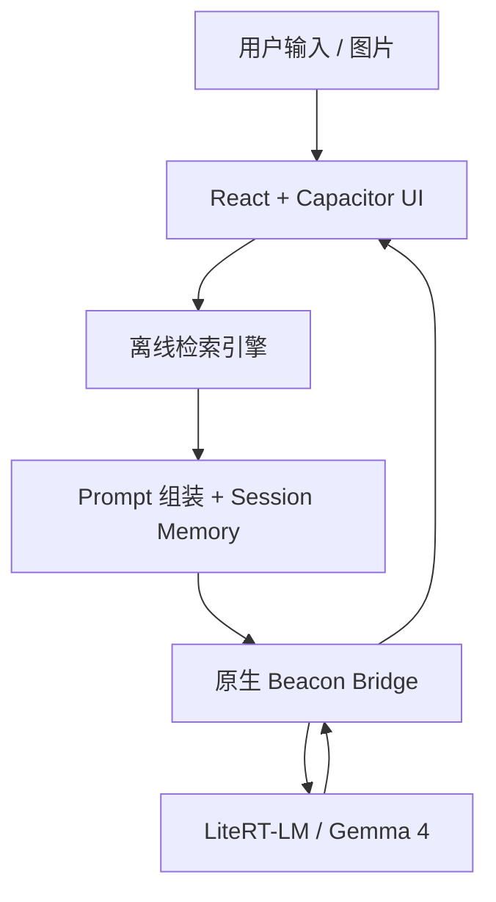

# Beacon

<p align="center">
  <strong>一个断网也能工作的本地应急自救应用，核心依赖真实端侧 Gemma 4 推理，而不是云端聊天接口。</strong>
</p>

<p align="center">
  仓库文档：
  <a href="./README.md">English</a>
  ·
  <a href="./README.zh-CN.md">简体中文</a>
  ·
  <a href="./README.zh-TW.md">繁體中文</a>
  ·
  <a href="./README.ja.md">日本語</a>
  ·
  <a href="./README.ko.md">한국어</a>
  ·
  <a href="./README.es.md">Español</a>
  ·
  <a href="./README.fr.md">Français</a>
  ·
  <a href="./README.de.md">Deutsch</a>
  ·
  <a href="./README.pt.md">Português</a>
  ·
  <a href="./README.ar.md">العربية</a>
</p>

<p align="center">
  <a href="./docs/assets/beacon-demo-hero-zh-CN.mp4">
    
  </a>
</p>

## 下载方式

- 直接从 [GitHub Releases](https://github.com/wimi321/Beacon/releases) 下载最新 Android ARM64 安装包
- 首次打开 App 后进入 `设置与模型`
- 优先下载 `Gemma 4 E2B` 作为推荐默认模型；如果设备更强、想要更高精度，可以再下载 `Gemma 4 E4B`

这条发布链路已经改成“轻量 APK 先安装，Gemma 模型进 App 再下载”的方式，和官方轻量壳思路一致，不再把超大模型硬塞进 GitHub 安装包。

## 多语言支持

Beacon 不只是 App 本身支持多语言，这个开源仓库现在也扩成了多语种 README、贡献指南、安全策略和演示素材体系。

仓库文档入口：

- 多语言 README 着陆页：[`English`](./README.md)、[`简体中文`](./README.zh-CN.md)、[`繁體中文`](./README.zh-TW.md)、[`日本語`](./README.ja.md)、[`한국어`](./README.ko.md)、[`Español`](./README.es.md)、[`Français`](./README.fr.md)、[`Deutsch`](./README.de.md)、[`Português`](./README.pt.md)、[`العربية`](./README.ar.md)
- 多语言贡献指南：[`CONTRIBUTING.md`](./CONTRIBUTING.md)、[`CONTRIBUTING.zh-CN.md`](./CONTRIBUTING.zh-CN.md)、[`CONTRIBUTING.zh-TW.md`](./CONTRIBUTING.zh-TW.md)、[`CONTRIBUTING.ja.md`](./CONTRIBUTING.ja.md)、[`CONTRIBUTING.ko.md`](./CONTRIBUTING.ko.md)、[`CONTRIBUTING.es.md`](./CONTRIBUTING.es.md)、[`CONTRIBUTING.fr.md`](./CONTRIBUTING.fr.md)、[`CONTRIBUTING.de.md`](./CONTRIBUTING.de.md)、[`CONTRIBUTING.pt.md`](./CONTRIBUTING.pt.md)、[`CONTRIBUTING.ar.md`](./CONTRIBUTING.ar.md)
- 多语言安全策略：[`SECURITY.md`](./SECURITY.md)、[`SECURITY.zh-CN.md`](./SECURITY.zh-CN.md)、[`SECURITY.zh-TW.md`](./SECURITY.zh-TW.md)、[`SECURITY.ja.md`](./SECURITY.ja.md)、[`SECURITY.ko.md`](./SECURITY.ko.md)、[`SECURITY.es.md`](./SECURITY.es.md)、[`SECURITY.fr.md`](./SECURITY.fr.md)、[`SECURITY.de.md`](./SECURITY.de.md)、[`SECURITY.pt.md`](./SECURITY.pt.md)、[`SECURITY.ar.md`](./SECURITY.ar.md)
- 国际化说明：[`docs/I18N.md`](./docs/I18N.md)、[`docs/I18N.zh-CN.md`](./docs/I18N.zh-CN.md)
- README 演示素材目前也已经扩展到和 README 相同的 10 种语言

App 当前已支持以下 20 种语言：

| 语言代码 | 语言 | 本地显示名 | 方向 |
| --- | --- | --- | --- |
| `en` | 英语 | English | LTR |
| `zh-CN` | 简体中文 | 简体中文 | LTR |
| `zh-TW` | 繁體中文 | 繁體中文 | LTR |
| `ja` | 日语 | 日本語 | LTR |
| `ko` | 韩语 | 한국어 | LTR |
| `es` | 西班牙语 | Español | LTR |
| `fr` | 法语 | Français | LTR |
| `de` | 德语 | Deutsch | LTR |
| `pt` | 葡萄牙语 | Português | LTR |
| `ru` | 俄语 | Русский | LTR |
| `ar` | 阿拉伯语 | العربية | RTL |
| `hi` | 印地语 | हिन्दी | LTR |
| `id` | 印度尼西亚语 | Bahasa Indonesia | LTR |
| `it` | 意大利语 | Italiano | LTR |
| `tr` | 土耳其语 | Türkçe | LTR |
| `vi` | 越南语 | Tiếng Việt | LTR |
| `th` | 泰语 | ไทย | LTR |
| `nl` | 荷兰语 | Nederlands | LTR |
| `pl` | 波兰语 | Polski | LTR |
| `uk` | 乌克兰语 | Українська | LTR |

## 演示素材

- 中文首页截图：[`docs/assets/beacon-home-android-zh-CN.png`](./docs/assets/beacon-home-android-zh-CN.png)
- README 首屏 GIF：[`docs/assets/beacon-demo-hero-zh-CN.gif`](./docs/assets/beacon-demo-hero-zh-CN.gif)
- 短视频：[`docs/assets/beacon-demo-hero-zh-CN.mp4`](./docs/assets/beacon-demo-hero-zh-CN.mp4)
- 海报帧：[`docs/assets/beacon-demo-hero-zh-CN-poster.png`](./docs/assets/beacon-demo-hero-zh-CN-poster.png)
- 重新生成命令：`npm run readme:demo:zh`

## 它是什么

Beacon 想解决的不是“在线问答”，而是更残酷的场景：

- 没信号
- 电量低
- 用户恐慌
- 周围没有专业人员
- 手机必须立刻给出能执行的建议

所以 Beacon 不是普通聊天 App，而是一套离线优先的移动端应急系统：

- 本地 Gemma 4 推理
- 本地知识库检索增强
- 原生相机/相册视觉求助入口
- 多语言与阿拉伯语 RTL 支持
- 会话记忆与返回主页重置
- 原生电量、位置、SOS 封包能力

## 当前能力

| 模块 | 当前状态 |
| --- | --- |
| 文本急救问答 | 已接入本地模型与离线知识检索 |
| 视觉求助 | 已支持拍照或从本机照片导入并进入本地视觉流程 |
| 离线知识库 | 已内置 6,302 个来源、14,229 条离线知识条目 |
| 多语言 | UI 已支持 20 种语言 |
| 原生壳 | Android / iOS 工程均已在仓库内 |
| 会话记忆 | 已支持最近轮次记忆、摘要记忆、视觉上下文记忆 |

## 知识库来源

当前离线知识库已覆盖以下主来源：

- 美军 `FM 21-76 / FM 3-05.70` 野外生存手册
- `NPS` 国家公园野外求生指南
- `NWS / NOAA` 雷暴、洪水、极端天气安全页
- `CDC` 户外危险、热伤害、低温、辐射、中毒、生物风险资料
- `Ready.gov` 火灾、洪水、核辐射、爆炸、断电、避难等灾害指南
- `WHO`
- `Merck / MSD Manual`
- `NHS`
- `MedlinePlus`
- `American Red Cross`

Beacon 的策略不是“知识库没命中就装死”，而是：

- 能命中时，用知识库高权重约束模型
- 命不中时，仍然进行真实本地模型推理
- 不允许前端假 AI 模板兜底

## 仓库发布说明

为了让公开仓库可以正常推送到 GitHub：

- 原生壳里同步出来的前端构建产物不纳入源码版本控制
- 体积超出 GitHub 普通 git 限制的 iOS LiteRT vendor 静态库也不直接入库

详情见 [`ios/App/Vendor/README.md`](./ios/App/Vendor/README.md)。

## 技术架构



## 运行方式

### 安装依赖

```bash
npm install
```

### 构建前端并同步原生工程

```bash
npm run mobile:build
```

### 打开原生工程

```bash
npm run mobile:android
npm run mobile:ios
```

### 安卓发布构建

```bash
npm run mobile:android:release
```

### GitHub 轻量 APK 构建

```bash
npm run mobile:android:release:github
```

## 常用命令

```bash
npm test
npm run build
npm run knowledge:build
npm run mobile:build
npm run mobile:android
npm run mobile:ios
npm run mobile:android:release
```

## 当前项目状态

这是一个认真可运行的公开预发布版本，不是假 Demo，但也还不是最终版。

已经完成：

- 前端测试通过
- Android 单测与 Debug 构建通过
- 本地知识库已入库
- 原生相机与照片导入流程已接通
- 多语言 UI 已完成
- Android / iOS 原生桥接已接入

仍在持续打磨：

- 更多真机矩阵验证
- iOS 端 GPU / runtime 稳定性继续收口
- Mesh 近场中继能力
- 面向商店发布的最终元数据与发布流程

## 安全声明

Beacon 不是医生、医院或专业救援队的替代品。

- 有信号时，优先联系当地急救与救援系统
- Beacon 更适合“断网、断联、延迟获救”的最后一公里自救场景
- 高风险医疗决策请尽量交给专业人员确认

## 仓库说明

- 集成文档：[`docs/Backend-Integration.md`](./docs/Backend-Integration.md)
- 需求文档：[`docs/开发文档.txt`](./docs/开发文档.txt)
- 用户视角验收清单：[`docs/User-E2E-Acceptance-Checklist.md`](./docs/User-E2E-Acceptance-Checklist.md)
- 贡献指南：[`CONTRIBUTING.md`](./CONTRIBUTING.md)
- 中文贡献指南：[`CONTRIBUTING.zh-CN.md`](./CONTRIBUTING.zh-CN.md)
- 安全策略：[`SECURITY.md`](./SECURITY.md)
- 中文安全策略：[`SECURITY.zh-CN.md`](./SECURITY.zh-CN.md)
- 国际化说明：[`docs/I18N.zh-CN.md`](./docs/I18N.zh-CN.md)
- 社区准则：[`CODE_OF_CONDUCT.md`](./CODE_OF_CONDUCT.md)
- 版本记录：[`CHANGELOG.md`](./CHANGELOG.md)

## 社区协作

- 缺陷反馈：使用 GitHub Bug Report 模板
- 功能建议：使用 GitHub Feature Request 模板
- 安全问题：按 [`SECURITY.md`](./SECURITY.md) 里的方式走私密渠道
- 多语言贡献：查看 [`docs/I18N.zh-CN.md`](./docs/I18N.zh-CN.md)
- 讨论区：使用仓库 Discussions 做路线、设计和协作讨论

## 许可证

当前公开版本使用 [`Apache-2.0`](./LICENSE) 许可证。
