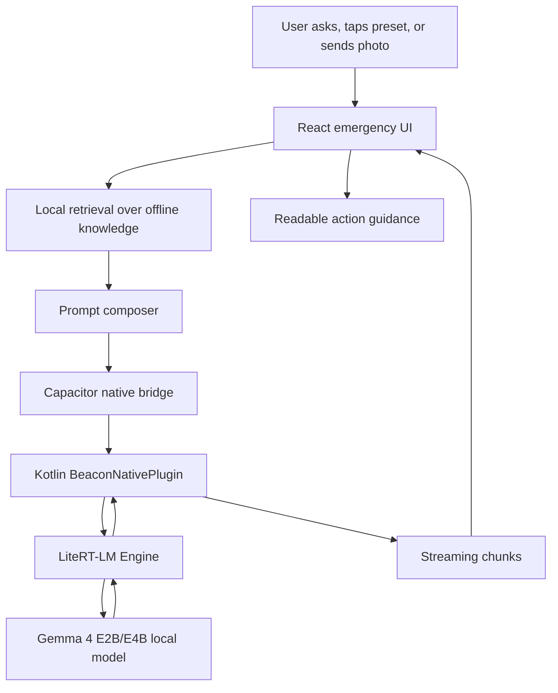
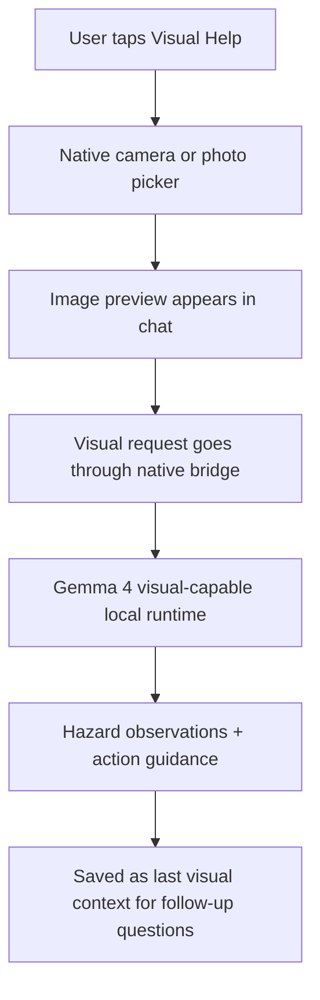

# Competition Architecture

Beacon is designed as an Android-first, offline-first mobile app. The critical architecture goal is simple: do not require a server when the user is already in trouble.

## Runtime Stack

| Layer | Implementation | Responsibility |
| --- | --- | --- |
| UI | React + TypeScript | Panic cards, chat, model manager, language switcher, camera/photo flows. |
| Mobile shell | Capacitor | Native bridge, app lifecycle, permissions, Android packaging. |
| Android native | Kotlin | Model download/load, LiteRT-LM inference, streaming, diagnostics, image intake. |
| Model runtime | Google AI Edge LiteRT-LM | On-device Gemma 4 E2B/E4B execution. |
| Retrieval | Local JS/TS knowledge engine | Finds emergency/survival context before inference. |
| Data | Bundled JSON knowledge base | 6,332 source records and 14,406 entries in the current development bundle. |

Android dependency proof:

```gradle
implementation "com.google.ai.edge.litertlm:litertlm-android:0.10.0"
```

Model allowlist proof:

```json
{
  "id": "gemma-4-e2b",
  "fileName": "gemma-4-E2B-it.litertlm",
  "accelerators": ["gpu", "cpu"]
}
```

## End-to-End Flow



## Prompt Composition

Beacon intentionally avoids a large persona prompt. The model receives:

1. `LANGUAGE` - requested response locale.
2. `SESSION_SUMMARY` - compact prior context when available.
3. `RECENT_CHAT_CONTEXT` - recent user/assistant turns.
4. `LAST_VISUAL_CONTEXT` - prior photo analysis when available.
5. `USER_INPUT` - the current user message.
6. `KNOWLEDGE_BASE` - top retrieved offline entries.

System instruction:

> You are Beacon. Answer directly according to the user input, referring to retrieved knowledge when useful. The knowledge base is only a reference; if it does not cover the question, still answer.

## No Fake AI Fallback

For the competition demo, this is a hard invariant:

- If Gemma 4 is not downloaded, the app must ask the user to download a local model.
- If the native runtime fails, the app must show a model/runtime error.
- The frontend must not generate pretend emergency guidance.
- Mock bridges are allowed only in tests and web preview.

Relevant guardrail:

```text
Native local model loader is not connected. Beacon refuses to fake model state.
```

## Model Download Strategy

The public APK does not bundle weights by default. Users download Gemma 4 in-app.

Order for each model:

1. ModelScope mirror for China-friendly access.
2. `hf-mirror.com`.
3. Official Hugging Face source.

This makes the demo lighter and more realistic while keeping weights user-controlled.

## Visual Help Flow



Competition video should show the image appearing in the chat before the answer. This proves the user experience is coherent and the photo is attached to the emergency session.

## Runtime Diagnostics To Show Judges

The final demo should capture or export:

- App version.
- Device model and Android version.
- Loaded model ID.
- Artifact format: `litertlm`.
- Runtime stack: `litert-lm-c-api` or native Android LiteRT-LM equivalent.
- Active backend: GPU or CPU.
- Whether GPU warmup passed.
- Whether the answer was generated offline.
- Knowledge entries retrieved for the current question.

## Current Known Boundary

Beacon is Android-first for the competition demo. iOS support exists in the repository, but iPhone release-device GPU validation should not be treated as complete until a supported iPhone passes the same offline Gemma 4 test matrix.
